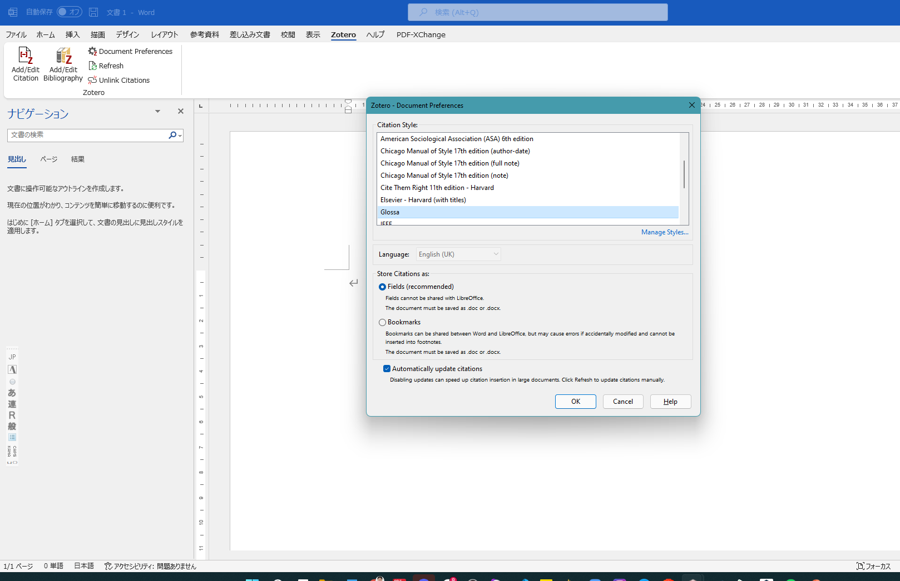

<!-- _class: title -->
# 文献管理ソフトZotero 入門ワークショップ

宮川 創
## So Miyagawa

京都大学 大学院文学研究科・文学部 助教
Twitter: @So_Miyagawa
miyagawa.so.36u@kyoto-u.jp
somiyagawa.com 
CC BY-SA 3.0
<!--
_color: #fffff9
-->

---
## Zotero について（20分）

- Zotero (ゾテロ)
    - アルバニア語の「マスターする」という意味の動詞に由来
- ジョージ・メイソン大学ロイ・ローゼンツヴァイク歴史・ニューメディアセンターが開発
- 文献管理ソフト
    - 研究で用いる文献の管理を容易にする
    - 引用や参照文献表の作成を容易にする
    - Microsoft WordやLaTeXなどで容易に使える

--- 

## 他の文献管理ソフトとどう違うか

- 無料でオープンソース
    - 有料のもの・・・EndNote, RefWorksなど
    - 無料だがオープンソースでないもの・・・Mendeleyなど
- グループによる文献管理が簡単
- 文献ライブラリの公開も用意

⇒これらの要因から近年、特に英語圏でZoteroが大変流行っている

---

## Zotero をインストールしてみよう

- Mac, Win, Linux, ブラウザ(クラウド版)で用いることができる
- [こちらからダウンロードしてください](https://www.zotero.org/)
- [アカウントも作ってみてください](https://www.zotero.org/user/register)

---
## Google ScholarやCiNiiから文献情報をインポートする（10分）

1. Google Scholar や CiNii で必要な文献の書誌情報を開く
2. BibTeXでエクスポートをクリック
3. BibTeXファイルをコピー
4. Zoteroにクリップボードからインポート
5. Zoteroのライブラリに書誌情報が追加された

---
## Zoteroを用いてWordで文献を引用する（30分）

1. 公開ライブラリをインポートしよう
2. ZoteroのWordアドオンをインストールしよう
3. Wordを開いてZoteroタブから引用情報や参照文献表を挿入しよう

---
# BibTeXとZoteroを交互に用いる（10分） 
---
# Zoteroを用いてLaTeXで文献を引用する（10分）
